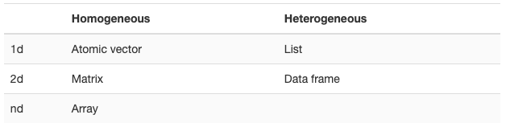
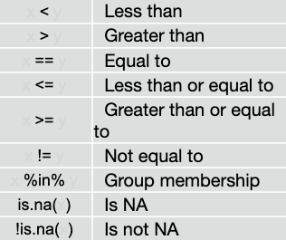

```{r setup, include=FALSE}
knitr::opts_chunk$set(echo = TRUE, warning = FALSE)
```

# R Markdown - Essentials

This is an R Markdown document. R Markdown is a formatting syntax for authoring HTML, PDF, and MS Word documents. For more details on using R Markdown see <https://rmarkdown.rstudio.com/lesson-1.html>.

You can use it to take notes and run code. For example, you can write your name on the line below. Try it: 


```{r}
# You can write code in chunks that look like this.
# This chunk uses some code from base R to plot a data set.
# To run the code click the Green play button to the right. Try it!
plot(cars)

# Sometimes you might want to run only some of the code 
# in a code chunk. To do that, highlight the code to 
# run and then press Cmd + Enter (Control + Enter on 
# Windows). If you do not highlight any code, R will 
# run the line of code that your cursor is on.
```

Good job! The results of a code chunk will appear beneath the chunk. You can click the x above the results to make them go away, but let's not do that.

You can open a new R Markdown by going to **File > New File > R Markdown**.

## Adding chunks

To add a new chunk, press *Cmd+Option+I* (*Ctrl+Alt+I* on Windows), or click the *Insert* button at the top of this document, then select *R*. 
Try making a code chunk below:


Good job! For now, you should place all of your *R code* inside of code chunks.

```{r}
# You can click the downward facing arrow to the left of the play button to run
# every chunk above the current code chunk. This is useful if the code in your
# chunk depends on the code in previous chunks. For example, if you use an
# object or data set made in a previous chunk.
# 
# Sys.Date()
# Sys.Date()+1
```

## Commenting

Did you notice the green lines in the code chunk above? They are *code comments*, lines of text that R ignores when it runs the code. R will treat everything that appears after `#` on a line as a code comment. As a result, if you run the chunk above, nothing will happen—it is all code comments (and that's fine)!

Remove the `#` on the last line of the chunk above and then rerun the chunk. 
Can you tell what `Sys.Date()` does?

Today, we may want to remove comments from multiple lines of code above. 

Highlight the last _two_ lines of code above and enter *Cmd+Shift+C* (*Ctrl+Shift+C* on Windows)
to uncomment them both at the same time 

You only need to use code comments _inside_ of code chunks. R knows not to try to run the text that you write outside of code chunks.


*Your turn ! *
What's the sum of 5493 and 9345? You can simply use the `+` sign.
Create a code chunk and give it a try! 

# R Packages

Uncomment and run the code below to install and load the tidyverse packages!

## Tidyverse

```{r}

# install.packages("tidyverse")
library(tidyverse)
```

Remember - once per R sessions we must load the packages using the `library()` function

This tells you that tidyverse is loading the ggplot2, tibble, tidyr, readr, purrr, and dplyr packages. These are considered to be the core of the tidyverse because you’ll use them in almost every analysis.

Let's get into some data!

# Import

Run the following code chunk to import the babynames dataset 

```{r}
getwd()
babynames <- readr::read_csv("data/babynames.csv")
```

Names and sex of babies born in the US from 1880 to 2017. 1.9M rows.

## Assigning R objects 

`babynames` was assigned as an object in our R environment above. 
Save information as an R object with the greater than sign followed by a minus, e.g, an arrow: `<-`


```{r}
foo <- 42
foo
```

When you create an R object, you'll see it appear in your **Environment pane**

Usually in R you would assign the output of a function to a variable to save it and then to use it in a second function.

```{r}
foo <- round(3.1415) + 1 
foo
factorial(foo)
```

Because if you don't save the output in a variable, you would only output it to the console. And can't use it as an input for the next step


```{r}
round(3.1415) + 1 
```


## readr

A few different options for importing data. 

We can do it through the IDE by clicking *Import Data* and selecting the appropriate format and location

But there are advantages to doing this within our R script in code as we did above

- More control over various arguments or options
- Reproducible!

To do this - we need to know a bit about *directories*
Take a look below or pay attention to slides ot learn a bit more 

R associates itself with a folder (i.e. directory) on your computer. 
*To see which one, run getwd() at the console.*

- This folder is known as your "working directory"
- When you save files, R will save them here
- When you load files, R will look for them here

We can change working directories using the IDE or using code

```{r, eval = FALSE}
# 
# setwd("day01_02")
# babynames <- readr::read_csv("data/babynames.csv", n_max = 10)
# setwd("/cloud/project")

```

`readr` is a great package for reading in tabular and non-tabular data 

The goal of readr is provide a fast and friendly way to read rectangular data. It was designed to be flexible and parse many types of data found in the wild:

- It has seven different read_ functions
- Can declare explicit column data types.
- Has ways to read files line by line or chunks

Many other packages for reading in all types of data

# Data Classes

Let's take a look at our baby names data sets

```{r}
glimpse(babynames)
?glimpse
str(babynames)
names(babynames)
```


Tibble = an “enhanced” data frame for storing and printing tabular data.

Like Excel, R can recognize different types of data.
We'll look at four basic types:

 * numbers 
 * character strings (text)   
 * logical   
 * factor
 
Check the type (class) of any R object with `class()` function 

A word on factors

R's form of categorical data.
Especially useful for modeling and plotting.
Saved as an integer with a set of labels (e.g. levels).

```{r}
vec2 <- c("a", "b","b", "c", "d", "a") # vec2 is a character vector
fac <- factor(vec2) #now fac is factor
class(fac)
fac
```

One can easily change the "labels" e.g. `levels` of a factor

Let's change `a` to `apple` and `d` to `dragonfruit`

```{r}
fac
levels(fac)
levels(fac) <- c("apple", "b", "c", "dragonfruit")
fac
```

# Data Structures



R’s base data structures can be organised by their dimensionality (1d, 2d, or nd) and whether they’re homogeneous (all contents must be of the same type) or heterogeneous (the contents can be of different types). This gives rise to the five data types most often used in data analysis

## Key Takeaways


 1. There are data classes (types) such as: 
  * character 
  * numeric 
  * logical 
  * factor
 2. There are also data structures: 
  * vector
  * matrix
  * list
  * data frame
 3. Some data structures **can't** contain different classes (types) of data (e.g. they can only contain one type of data):
  * vector
  * matrix
4. Some data structures **can** contain different classes (types) of data (e.g. they can contain multiple types of data):
  * list
  * data frame


# Transform

Let's learn a little bit on how to *Tranform* our data. Also referred to as data munging/prepping/tidying. 

Follow long with slides

## dplyr

A package that transforms data.
`dplyr` implements a grammar for transforming tabular data.

There are a few common functions we'll use for *isolating* portions of our full dataset

```{r results = FALSE, message= FALSE}

?select   # extract  variables
?filter   # extract cases
?arrange  # reorder cases 
```


```{r}
head(babynames)

# select year

babynames %>% 
  select(year) %>% 
  summary()

# filter where 1989, arrange desc proportion, only and look return only 10 rows

babynames %>% 
  filter(year == 1989) %>% 
  arrange(desc(prop)) %>% 
  slice(1:10)


# library(babynames)
```


### Your Turn 1

Alter the code to select just the `n` column:

```{r}
select(babynames, name, prop)
# 
# babynames %>% 
#   select(name, prop)
```

*Select* helpers 

```{r}
?select
```


### Quiz

Which of these is NOT a way to select the `name` and `n` columns together?

```{r}
select(babynames, -c(year, sex, prop))
select(babynames, name:n)
select(babynames, starts_with("n"))
select(babynames, ends_with("n"))
```

*Filter*

Filter records/rows that meet one or more logical tests




NOTE: use shortcuts *Cmd+Shift+M* (*Ctrl+Shift+M* for Windows) to insert the pipe `%>%`  operator

```{r}
babynames %>%
  filter(name %in% c("Bowie","Beau"))  %>% 
  filter(year == 2017)
```


### Your Turn 2

Use `filter`, `babynames`, and the logical operators to find:

* All of the names where prop is greater than or equal to 0.08  
* All of the children named "Sea"  


```{r}

```

Don't forget 

- `==` not `=`
- Treat values as the variable type R expects ("Sea")

*Boolean* operators can be used to combine conditions and make your search more precise

Use `|` to denote one condition *or* the other needing to be meet
Use `!` to negate a condition or note "NOT" meeting the value specified
Use `&` to denote and, or both conditions needing to be met
If multiple conditions separated by commas, `&` is assumed

```{r}
babynames %>% 
  filter(name == "Ben"|name == "Bowie", year == 2017)

```


### Your Turn 3

* _Boys_ named Sue  
* Names that were used by exactly 5 or 6 children in 1880  
* Names that are one of Acura, Lexus, or Yugo

```{r}
```
_NOTE_ We can string together many tests or use  `%in%`

### Your Turn 4

Use `%>%` to write a sequence of functions that: 

1. Filters babynames to just the girls that were born in 2017, *then...*  
2. Selects the `name` and `n` columns, *then...*  
3. Arranges the results so that the most popular names are near the top using the *`arrange()`* function

```{r}
```


*summarise*

Compute summary tables 

Summary functions

- Take a vector as input 
- Return a single value as output

```{r}
babynames %>% summarise(total = sum(n), max = max(n))
```

Some useful summary functions 

```{r}
#n() = the number of rows in a dataset/group
babynames %>% summarise((n = n()))

#n_distinct() = The number of distinct values in a variable
babynames %>% summarise(n = n(), nname = n_distinct(name))

```

*group_by*

Groups cases by common values 

```{r}
babynames %>% 
  group_by(sex) %>%
  summarise(total = sum(n))

```

*ungroup()*

Removes grouping criteria from a data frame

```{r}

babynames %>% 
  group_by(sex) %>%
  # ungroup() %>%
  summarise(total = sum(n))

```

`group_by` multiple

```{r}

babynames %>%
  group_by(year, sex) %>% 
  summarise(total = sum(n)) %>% 
  arrange(desc(year))

```


*mutate*

Create new columns

```{r}
babynames %>%
  mutate(percent = round(prop*100, 2))
```

Can rank too
`min_rank`
A go-to ranking function (ties share the lowest rank)

```{r}
min_rank(c(50, 100, 100, 1000))
```


### Your Turn 5

Use `group_by()`, `summarise()`, and `arrange()` to display the ten most popular names. Compute popularity as the *total* number of children of a single gender given a name.

*(Hint: Be sure to remove each `_` before running the code)*

```{r eval=FALSE}
babynames %>%
  _______(name, sex) %>% 
  _______(total = _____(n)) %>% 
  _______(desc(_____))
  
```

### Take aways

* Extract variables with `select()`  
* Extract cases with `filter()`  
* Arrange cases, with `arrange()`  

* Make tables of summaries with `summarise()`  
* Make new variables, with `mutate()`  
* Do groupwise operations with `group_by()`

* Connect operations with `%>%`  


## tidyr

Remember tidy data is data where 

- Every column is variable.
- Every row is an observation.
- Every cell is a single value

Key package features:

- Reshape data
- Split cells
- Handle missing values
- Expand tables

Today we will focus on reshaping our data 

Run the code chunk below to load `tidyr` and our toy data set
```{r}
library(tidyr)

datoy_wide <- tribble(
       ~Name,   ~English, ~Math, 
        "Ben", 19.0,58.5,
  "Sam", 6.7,51.8,
  "Sarah", 14.9,45.1
)
```

*pivot_longer*: One variable spread across multiple columns

- Column headers are values, not variables

**The pivot_longer function can help!**

```{r}
datoy_wide
```

- 3 variables
  + *Name* stored in rows
  + *Subject* spread across column names
  + *Score* stored in cell values
  
To tidy we need to use pivot_longer to make the following transformation

- The first argument is the *data* to reshape *datoy_wide*
- The second argument describes which *cols* needs to be reshaped, in this case it's *English & Math*
- The *names_to* argument gives the name of the variable that will be created from the data stored in the column names, i.e. *Subject*
- The *values_to* gives the name of the variable that will be created from the data stored in the cell value, i.e. *Score*
    + Neither the names_to nor the values_to column exists in datoy_wide, so we provide them as character strings surrounded in quotes.

Let's code it!

```{r}
?pivot_longer
datoy_long <- datoy_wide  %>% 
  pivot_longer(-Name, names_to = "subject", values_to = "score")
```

## Your Turn 1

Uncomment the code below and fill in to tidy the relig_income dataset 

```{r eval= FALSE}

relig_income %>% 
  head()

relig_income %>%
pivot_longer(
  cols = ________,
  names_to = "income",
  values_to = "count"
  )

```

### Your Turn 2

Uncomment the code below and fill in to tidy the relig_income dataset

- Try a different way of selecting "cols" than we did above and be sure to fill in arguments names_to and values_to

```{r}
relig_income %>% 
  head()

#relig_income %>% 
# pivot_longer(
#   cols = , 
#   names_to = ,
#   values_to = 
#   )

```

### Quiz

Which of the following would NOT have worked?

1. pivot_longer(data = relig_income,cols = -c(religion), names_to = "income", values_to = "count")

2. pivot_longer(data = relig_income,cols = 2:11, names_to = "income", values_to = "count")

3. pivot_longer(data = relig_income,cols = `<$10k`:`Don't know/refused`, names_to = "income", values_to = "count")

4. pivot_longer(data = relig_income,cols = <$10k:Don't know/refused, names_to = "income", values_to = "count")
 
>syntactically valid names consists of letters, numbers and the dot or underline characters and starts with a letter or the dot not followed by a number

## pivot_wider: An observation is scattered across multiple rows

- Some values are actually variables (i.e., variables stored in a column)
  + In this instance, we would use pivot_wider to make tidy data

Remember - both of these functions may be helpful when we need data to look a certain way for graphing. More on that soon 
  
Run the following code chunk to load the data and view top rows

```{r echo = FALSE}
weather <- readr::read_csv("data/weather.csv") %>% 
  pivot_longer(d1:d31, names_to = "day", names_prefix = "d",
               values_to = "value", values_drop_na = TRUE) 
weather %>% 
  head()

```


- Most variables have individuals columns *(id, year,month, day, value)* but two variables
*(tmax, tmin)* are spread across rows, and stored in the "element" column.
  + Element is not a variable - it's a column that stores the names of two variables

_Note_ - we may actually want the data like this for graphing! But maybe for modeling, we don't, 
if we want to use tmax or tmin as predictors

- Fixing this requires **pivot_wider** function 
  + Performs the inverse of **pivot_longer** by spreading the *element* and *value* columns back out into columns
  
```{r}
weather %>% 
  pivot_wider(names_from = element, values_from = value) %>% 
  head()

?pivot_wider
```

- The first argument is the *data* to reshape *weather*
- The *names_from* and *values_from* are paired arguments describing which column (or columns) to get the name of the output column *(name_from = element)*, and which column (or columns) to get the cell values from *(values_from = value)*

- In practice, relatively rare to need pivot_wider for tidying, but it's often useful for creating summary tables for presentation and prepping data for plots


Remember we tidied the scores data 

```{r}
datoy_long

```

What if we wanted this in wide format for a summary table?

### Your Turn 3

Convert `datoy_long` back to a wide formate so we can use it as a summary table 

- Make the variables Name, English, Math
- Make the Values of the _new_ variables those that are currently in the score column

```{r}
datoy_long 
```


*Putting it all together*

Load & examine the following dataset 

```{r}
stocks <- tibble(
  time = as.Date('2009-01-01') + 0:9,
  X = rnorm(10, 0, 1),
  Y = rnorm(10, 0, 2),
  Z = rnorm(10, 0, 4)
)

stocks
```

### Your Turn 4

Make a new dataset "tidy_stocks" by using the appropriate pivot function to tidy

Hint: the new dataset should have 3 columns

```{r}

```

### Your Turn 5 

After you've tidied stocks, make another table "untidy_stocks" by putting "tidy_stocks"
back in its original format:

```{r eval= FALSE}
#desired
head(stocks)
#from tidy_stocks created above
head(tidy_stocks)

untidy_stocks <- tidy_stocks %>% 
#  pivot_?????()

#check
#head(untidy_stocks)
```

### Take aways

Often "tidy" data is best for analyses

* `pivot_longer()` often used to tidy
    _ When Column headers are values not variables
* `pivot_wider()` also used to tidy, but often used to make summary tables or prep for plotting
    - When we want a summary table or when variables are stored in a column

`tidyr` also has a lot of great functions we won't cover in depth, but you can check them out [here](https://github.com/rstudio/cheatsheets/blob/master/data-import.pdf)

Some handy ones 

* `replace_na` - handle missing values and replace
* `separate_rows` - separate each cell in a column to make several rows
* `unite` - collapse cells across several columns to make a single column
* `complete` - create a new tibble, with all possible combinations of the values of the variables listed


# Visualize

Let's learn some foundational *Visualize* concepts and the essential packages for creating beautiful visuals in R

Follow long with the slides

## ggplot2

Today we will first work with `salaries.csv` data and explore this data set by visualization. We will then use the `wages` data set for other examples and "your turn". 


Let's start by importing the `salaries` data set first.

```{r}
salaries <- read_csv("data/salaries.csv")
```

The data set contains the yearly salaries for academic positions based on years of experience, gender and discipline. 

- R has a variety of visualization tools.   
- These tools can be general and applied to any field or data.   
- Some packages can also be very field specific.  

**Base R vs ggplot2()**    

- Base R ` plot() ` -- See `?plot`   
- ggplot2 -- See `?ggplot2::ggplot2`     


*Base R visualization*

- Simplest plotting in R   
- Not very pretty
- Difficult to customize   
- Not so bad if you just want to use it for quick data exploration

**Basic plot syntax:**   

`plot(x , y)` `x`: vector for x axis, `y`: vector for y axis    

See `?plot`  

```{r, eval=T, echo=T, fig.align='center'}
x <- 1:10 
y <- 1:10
plot(x, y)
```


*ggplot2: Create Elegant Data Visualizations Using the Grammar of Graphics*

+ A system for 'declaratively' creating graphics, based on "The Grammar of Graphics". 
+ You provide the data, tell `ggplot2` how to map variables to aesthetics, what graphical primitives to use, and it takes care of the details.
+ Infinite options for the ultimate customization
+ It is part of the [tidyverse](http://tidyverse.org/), a collection of R packages that share common philosophies and are designed to work together.
+ For coding references go to: https://ggplot2.tidyverse.org/reference/


   
1. Start with `ggplot()`, 
    - supply a dataset   
    - and aesthetic mapping using `aes()`. 
    
2. You can then add on layers such as: 
    - Geom (geometric object) with various `geom_` functions.
    - Scales with various `scale_` or `labs()` and `lims()` functions.
    - Faceting specifications with `facet_` functions   
    - Coordinate systems with `coord_` functions   

*Building a ggplot from scratch with `salaries` *

_Step 0: Let's refresh on  the `salaries` data_
```{r}
head(salaries, 3)
summary(salaries)
```


*Step 1. Define data and aesthetics with `aes()`*

```{r}
ggplot(data=salaries, aes(x=yrs.service, y=salary))
```

*Step 2. Define plot type with `geom_`*

```{r}
ggplot(data=salaries, aes(x=yrs.service, y=salary)) + 
  geom_point()
```

*Step 3. Assign more aesthetics*

*Step 3.1 Add aesthetics: `color`*

```{r}
ggplot(data=salaries, aes(x=yrs.service, y=salary)) + 
  geom_point(aes(color=discipline))
```

*Step 3.2 Add aesthetics: `color` + `size`*

```{r}
ggplot(data=salaries, aes(x=yrs.service, y=salary)) + 
  geom_point(aes(color=discipline, size=yrs.since.phd))
```

*Step 3.3  Add aesthetics: `color` + `size` + `shape`*

```{r}
ggplot(data=salaries, aes(x=yrs.service, y=salary)) + 
  geom_point(aes(color=discipline, size=yrs.since.phd, shape=rank))
```

*Step 3.4  Add aesthetics: (`color` + `size` + `shape`) + `alpha`  (transparency)*

```{r}
ggplot(data=salaries, aes(x=yrs.service, y=salary)) + 
  geom_point(aes(color=discipline, size=yrs.since.phd, shape=rank), alpha=0.6)
```

*Step 4: Assign more `geom`: `point` + `smooth`*

What do you think the following will give me?

```{r}
ggplot(data=salaries, aes(x=yrs.service, y=salary)) + 
  geom_point(aes(color=discipline, size=yrs.since.phd, shape=rank), alpha=0.6) +
  geom_smooth()
```

Ooops! What happened??  

- Smooth line was created for the entire data and **not for each group of discipline.** 
- Why?

Now try this one: 

```{r}
ggplot(data=salaries, aes(x=yrs.service, y=salary, color=discipline)) + 
  geom_point(aes(size=yrs.since.phd, shape=rank), alpha=0.6) +
  geom_smooth()
```

Why did this work now?   
Can you see the difference?


What about this?
What's happening here?

```{r}
ggplot(data=salaries, aes(x=yrs.service, y=salary)) + 
    geom_point(aes(size=yrs.since.phd, shape=rank), alpha=0.6) +
  geom_smooth(aes(color=discipline))
```

Now the color is only defined in the `geom_smooth` and not for `geom_point`


**Step 5: Pretty up our plot**

Before we start, let's took couple of steps back, and remove shape and size aesthetics to simplify our plot.

So we will start with this plot:

```{r}
ggplot(data=salaries, aes(x=yrs.service, y=salary, color=discipline)) + 
  geom_point( alpha = 0.6) +
  geom_smooth()
```

We can also just assign plots to an R object and then keep adding more features to them. For example:

```{r}
my_plot <- ggplot(data=salaries, aes(x=yrs.service, y=salary, color=discipline)) + 
  geom_point( alpha = 0.6) +
  geom_smooth()
```

*Step 5.1: Change axis and legend titles*

```{r}
my_plot +
  labs(x= "Years of Service", 
       y= "Salary",
       color = "Disciplines")
```

*Step 5.2: Add more titles!*

Add more titles and reassign object!

```{r}
my_plot <- my_plot +
  labs(x= "Years of Service", 
       y= "Salary", 
       color = "Disciplines",
       # add more titles
       title = "Professor Salaries",
       subtitle = "Professor salaries of two disciplines plotted by years of service",
       caption = "Data from the internet")
my_plot
```

*Step 5.3: Change colors and adjust legend text*

```{r}
my_plot +
  scale_color_manual(values=c("royalblue", "firebrick"), # here we assigned colors
                     labels=c("Social Sciences", "Natural Sciences")
                     )
```


*Step 5.4: Change y-axis ticks to show comma after thousand. For that we will load another library called `scales`*

Let's  load the library:

```{r}
# install.packages("scales") ## un comment and run if not installed
library(scales)
```

Now, add comma after thousand and re-assign the object:

```{r}
my_plot <- my_plot +
  scale_color_manual(values=c("royalblue", "firebrick"), # here we assigned colors
                     labels=c("Social Sciences", "Natural Sciences")
                     ) +
  scale_y_continuous(labels = comma)

my_plot
```

*Step 5.5: Change theme*

```{r}
my_plot +
  theme_minimal()
```

*Step 5.6: Change font size or type*

```{r}
my_plot +
  theme_minimal() +
  theme(axis.title = element_text(size=14, family = "mono", face="bold"),
        title = element_text(size=16, family = "mono", face="bold"))
```

Depending on the output format you can check for available fonts with `names(pdfFonts())`


*Step 6: Facetting*

*Step 6.1: Facet `sex`*

Now, I would like to see how my previous graph look like for the subsets of `sex`.

```{r}
my_plot + facet_grid(. ~ sex) 
```

You can also plot it the other way:

```{r}
my_plot + facet_grid(sex ~ .)
```

*Step 6.2: Facet `sex` and `rank`*

You can add one more variable to facet:

```{r}
my_plot + facet_grid(rank ~ sex)
```

Now, try the other way around!

```{r}
my_plot + facet_grid(rank ~ sex)
```

You get the idea here right?

The format is:
```
my_plot + facet_grid(facet rows ~ facet columns)
```

*Step 6.3: Facet `wages`*

First, let's read the `wages` data in R.    

```{r}
wages <- read_csv("data/wages.csv", na = c("","  ","NA"))

head(wages, 3)

wages %>%
  ggplot(aes(age, earn, color=sex)) +
  geom_point() +
  geom_smooth()
```

Let's create age categories with `cut()` function. 

I will:   

+ transform the continuous `age` variable into a categorical variable with `cut()` function

+ set categorical intervals increasing by 10  years with the `breaks = seq(20, 100, by=10)` argument. 

+ assign this new variable to a new column called `age_cat`.   

```{r}
wages <- wages %>% 
  mutate(age_cat = cut(age, breaks = seq(20, 100, by=10)) )

head(wages, 4)


wages %>%
  count(age_cat)
```

Let's plot it

```{r}
pw <- ggplot(wages, aes(x=height, y=earn)) +
      geom_point(aes(size=ed), alpha=0.5)
pw

pw + facet_grid(~age_cat)
```

Hmm too squished for too many categories...

You can use `facet_wrap` if you want to facet by just 1 variable but you want to organize them nicely.

```{r}
pw + facet_wrap(~age_cat)
```

And you can specify the rows and columns for the faceting

```{r}
pw + facet_wrap(~age_cat, ncol=5)
```

### Your Turn 1 

Split into groups and try to replicate the plot shown on slide!

```{r}
ggplot(wages, aes(x=age, y=earn, color=sex)) +
  geom_point(aes(size=ed), alpha=0.5) +
  geom_smooth() +
  facet_wrap(~ race) +
  ggtitle("Yearly earnings by age")

```

`geom_col` and `geom_bar`


### Your Turn 2

```{r}

```


# Model 

Let's learn a little bit about modeling in R

Follow along with the slides

Remember, wages features income predictors extracted from the National Longitudinal Study, sponsored by the U.S. BLS

Let's work with our wages data set

First let's do a few preliminary steps to modeling. 

Let's check out the distribution of our outcome variable `earn`

### Your Turn 1 

Plot a histogram of `earn` and the log of `earn`

```{r}

```

Let's load some key packages we'll need

```{r}
# install.packages('modelr')
# install.packages('broom')

library(modelr)
library(broom)

```

Let's fit a model predicting the log of earn from education and look at the output

```{r}
mod1 <- lm(log(earn) ~ ed, data = wages)

summary(mod1)

```

- Output is not tidy, or even a dataframe.. would be hard to plot results

Broom includes three functions which work for most types of models (and can be extended to more):

- tidy() - returns model coefficients, stats
- glance() - returns model diagnostics
- augment() - returns predictions, residuals, and other raw values

```{r}
#tidy() returns useful model output as a data from 

mod1 %>% tidy()

#Returns common model diagnostics as a data frame

mod1 %>% glance()

#Returns data frame of model output related to original data points

mod1 %>% augment()
# 
# mod1 %>% augment(data = wages)

wages_noinf <-  wages %>% filter(!log(earn) == -Inf)
mod1 %>% augment(data = wages_noinf)

```


## Your Turn 2

Use a pipe to model `log(income)` against `height`. Call the model `mod_h`
Then use broom and dplyr functions to extract:

1. The **coefficient estimates** and their related statistics 
2. The **adj.r.squared** and **p.value** for the overall model

```{r}

```

What if we wanted to add multiple predictors?

*Multivariate regression*

We can simply add predictors using a `+` signed after the `~` 

```{r eval = FALSE}
glm(log(earn) ~ height + sex + age + ed + race, data = wages)

wages %>% 
  lm(log(earn) ~ ed + height, data = .) %>% 
  tidy()


```


## Your Turn 3

Model `log(income)` against `education` and `height` and `sex`. 
Name the model `mod_ehs`
Can you interpret the coefficients?

```{r}


# # In case you haven't made the ehs model
# mod_ehs <- wages %>% lm(log(earn) ~ ed + height + sex, data = .)

```

What is the difference between Mean log(income) for a female vs a male?

We can also use some `modelr` function to make predictions on new data 

For example, we could use the model `mod_ehs` we just fit and the values in the 
data frame provided to generate a prediction for each case in our df 


```{r eval=FALSE}
wages %>% add_predictions(mod_ehs)
```

Similarly, We can use the values in a data frame to generate a residual for each case. 

```{r eval = FALSE}
wages %>% add_residuals(mod_ehs)
```


## Your Turn 4

Use `add_predictions` to make the plot shown in the slides 

```{r warning = FALSE, message = FALSE, eval=FALSE}


# Make plot here

```

Lastly, `modelr` makes comparing multiple models easy. 

We can compare residuals for the models we've created above using `spread_residuals()` and 
`gather_residauls()`

- `spread_residuals()` will add residuals for the models we specify, to their own column
    + like `pivot_wider()` from earlier
- `gather_residuals()` will create "key:value" columns and a long data set, may be more useful for plotting 
    + like `pivot_longer` from earlier

```{r eval = FALSE}
wages %>% spread_residuals(mod_h, mod_ehs)

wages %>% gather_residuals(mod_h, mod_ehs) %>% arrange(desc(resid))
```


# Take Aways

* Use `glance()`, `tidy()`, and `augment()` from the **broom** package to return model values in a data frame.

* Use `add_predictions()` or `gather_predictions()` or `spread_predictions()` from the **modelr** package to visualize predictions.

* Use `add_residuals()` or `gather_residuals()` or `spread_residuals()` from the **modelr** package to visualize residuals.


